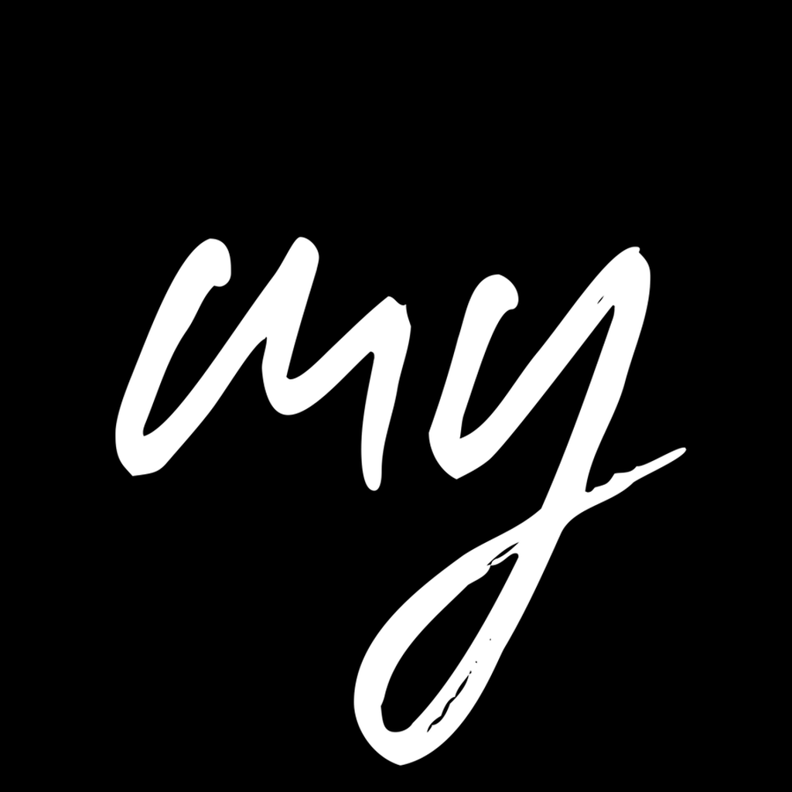
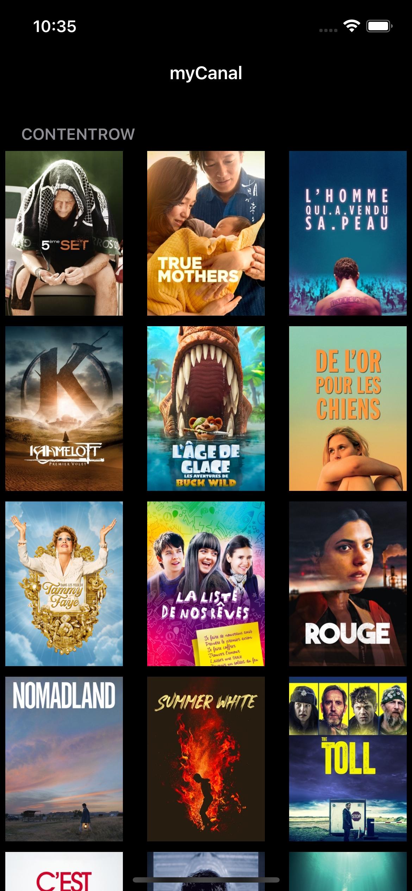
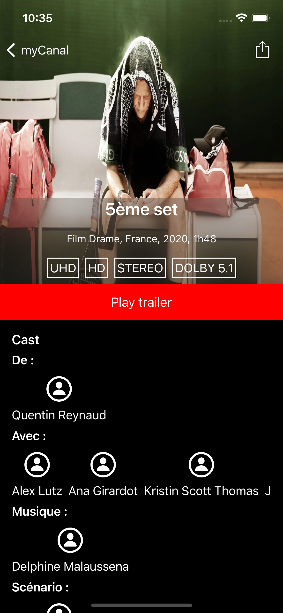
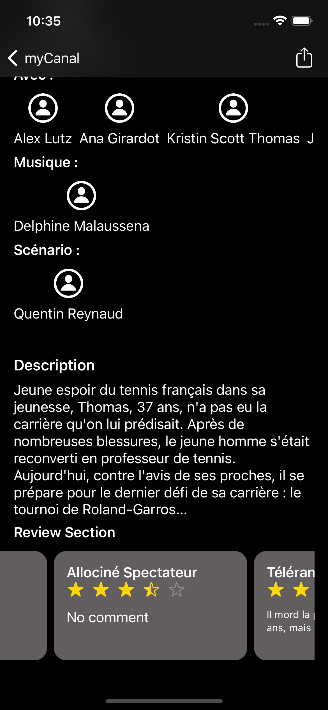
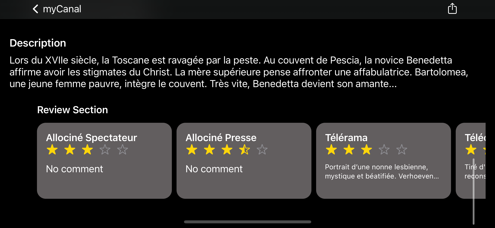
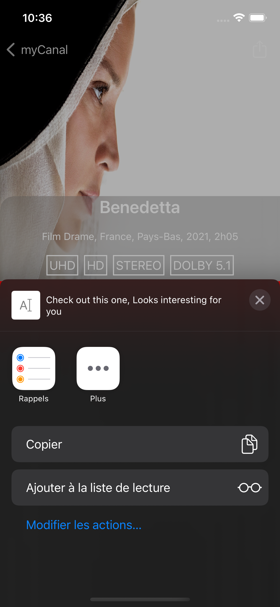

<strong>The Challenge Plus</strong>

# The Challenge Plus

This project contains an iOS One Page Application available on iOS13+.

About 10 hours spent on many separated days were spent on Designing, Developing and writing Tests scenarios.

## Build and Runtime Requirements
+ Xcode 13.0 or later
+ iOS 13.0 or later

## Configuring the Project

This project is a Clone & Build.
## Depencencies Reference

Uses Swift Package Manager to handle Third party dependencies.

| Name | Environment     | Description           |  Link                |
| :-------- | :------- | :------------------------- | :------------------------- |
| Kingfisher | `Release` | **Required**. used for image caching & HTTP Image requesting | https://github.com/onevcat/Kingfisher |
| Files | `Release` | **Required**. used as FileManager wrapper for Offline caching System | https://github.com/JohnSundell/Files |
| Inject | `Debug` | **Not Required**. Hot reload for Xcode | https://github.com/krzysztofzablocki/Inject |

## Overview

- This project uses a State of Art `Server Driven Development` Architecture.
- The Main entry View and Basic gestures are rendred and implemented directly from server response.
- Uses Reactive programming with UIKit and some Components in SwiftUI
- Uses Async / Await (iOS13) for Data Synchronisation.
- Views are 100% coded programmaticaly.
- Uses File based Caching system.
- Support Dark/ Light 
- Uses Github Actions CI for `Continuation Integration`

## Design Pattern - Architecture

Project build with Clean Architecture Principales.

- Data Synchronisation are handled using a Repository Pattern that guarante data automatically from cache or from api based on avaibility.  

### Design-Pattern 

Built in `MVVM-Controller` with Depencies Injection.

#### Choices behind

While `MVC` could have be a simpler solution, Dependencies Injection was the best solution for a project targeting `Testing First Principales`.

#### Architecture and Design Pattern
## Features

- [x] iOS Application using Reactive Programming with Combine Framework in a `MVVM-C` pattern.
- [x] Network and Datalayer Unit Testing with Test Driven Devlopment.
- [x] Uses `AutoLayout` Constraint programmatically. 0 Interface Builder (.storyboard / .xib).
- [x] Display data using modern `UICollectionViewDiffableDataSource` & `UITableViewViewDiffableDataSource`.
- [x] `SOLID` Principales 
- [x] Support `Swiftlint`.

## Screenshots

Dark - Light Support

[]
[]
[]
[]
[]
[]
